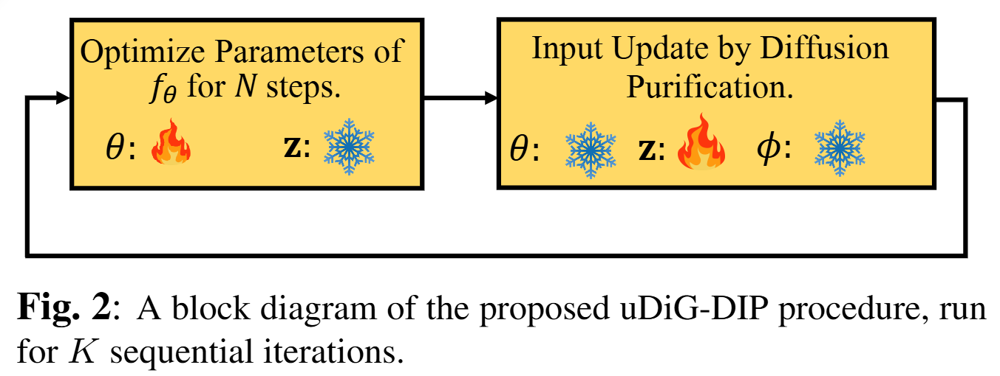

# uDiG-DIP: Sequential Diffusion-Guided Deep Image Prior For Medical Image Reconstruction 

## ICASSP 2025

## Abstract: 
Deep learning (DL) methods have been extensively applied to various image recovery problems, including magnetic resonance imaging (MRI) and computed tomography (CT) reconstruction. Beyond supervised models, other approaches have been recently explored including two key recent schemes: Deep Image Prior (DIP) that is an unsupervised scan-adaptive method that leverages the network architecture as implicit regularization but can suffer from noise overfitting, and diffusion models (DMs), where the sampling procedure of a pre-trained generative model is modified to allow sampling from the measurement-conditioned distribution through approximations. In this paper, we propose combining DIP and DMs for MRI and CT reconstruction, motivated by (*i*) the impact of the DIP network input and (*ii*) the use of DMs as diffusion purifiers (DPs). Specifically, we propose a sequential procedure that iteratively optimizes the DIP network with a DM-refined adaptive input using a loss with data consistency and autoencoding terms. We term the approach Seq**u**ential **Di**ffusion-**G**uided **DIP** (uDiG-DIP). Our experimental results demonstrate that uDiG-DIP achieves superior reconstruction results compared to leading DM-based baselines and the original DIP for MRI and CT tasks.



## Getting Started

### Download pre-trained modei weights

We are using the pretrained model from *"Score-based diffusion models for accelerated MRI"*
The pre-trained model checkpoints and data are (https://www.dropbox.com/scl/fo/mlkwofr24nmsnzixj5u4d/AI-JOLUOAzklINnr8FdKpdk?rlkey=p4bj5ny58tngsjd1j46iyoqh6&st=lba2c97z&dl=0).

```
# Download pre-trained model weights
mkdir -p './exp/vp'
wget -O './exp/vp/AAPM256_1M.pth' 'https://www.dropbox.com/scl/fi/hs75uqc9zgwi8en71g488/AAPM256_1M.pt?rlkey=s1otrarzz1tbr7j6nwc5rh1r6&dl=1'
wget -O './exp/vp/fastmri_brain_320_complex_1m.pth' 'https://www.dropbox.com/scl/fi/1884de5g904fch2bah4bl/fastmri_knee_320_complex_1m.pt?rlkey=qukkxajxp6broc1fn613cdvp2&dl=1'
```

### Download sample test data
```
# Download sample test data
mkdir -p './indist_samples'
wget -O './indist_samples/data.zip' 'https://www.dropbox.com/scl/fo/rlxuhs5maial9cnwc533d/h?rlkey=9zovjgghncnt8ej4acdsb1a5d&dl=1'
# Extract zip file
unzip -q ./indist_samples/data.zip -d ./indist_samples
```
By default, the above scripts places the pre-trained model checkpoints under ```exp/vp```, and the sample data under ```indist_samples```. When saving to different directories, you can reflect this by modifying the ```--dataset_path``` flag for the ```main.py``` file.

## uDiG-DIP Reconstruction
We provide demo scripts for the following inverse problems:
- Multi-coil MRI reconstruction (2d)
- Sparse-view CT reconstruction (2d)

Each experiment can be run using:
```
bash eval_MRI_multi.sh
bash eval_SVCT_2d.sh


